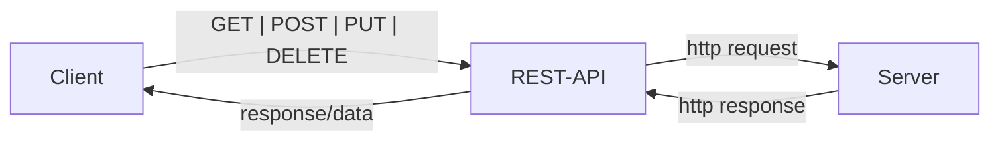
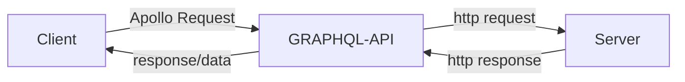

# GraphQL Crash Course with Full Stack MERN Project notes
[tut repo](https://github.com/bradtraversy/project-mgmt-graphql/tree/main)

# 1. Difference between GraphQL and REST API
 ## How REST API works
- A REST API has endpoints for all resources
  - The client sends a request to an endpoint
    - then the REST API receives it
      - routes it to an endpoint which retrieves the data from the database server
        - The data is then returned to the client, all the data for the endpoint.

flow diagram       


- All responses include ALL data
- Many endpoints for all resources
- The data will likely be JSON data (or HTML depenending on the API)

## How GRAPQL API works
- The GraphQL API only has a single endpoint
- It receives queries from the client using the Apollo server.
  - it then parses this query and sends it to database server
  - the server send an http response
  - graph ql then sends the info back to the client
    - only the data that the client has asked for.

flow diagram       

- Responses ONLY include the data asked for
- GraphQL-API is a single endpoint

## Queries Syntax
- example of a request/query
``` JS GraphQL Request/Query
{
  client(id: "100") {
    name,
    client {
      name
    }
  }
}
```
- example of a response
``` JS Server
{
  "data": {
    "project": {
      "name": "Mobile Application",
      "client": {
        "name": "Tony Start"
      }
    }
  }
}
```
- they look quite similar and are the syntaxt thus pretty easy to work with knowing javascript

## Mutations Syntax
- To add/update data to the server
``` JS GraphQL Mutation
mutation {
  addProject(
    // What you're updating
    name: "Mobile Application",
    description: "This is a description",
    status: "Not Started",
    clientId: "1") {
      // What you want to get back
      name
      description
      status
    }
}
```
- example of response
``` JS Server
{
  "data": {
    "addProject": {
      "name": "Mobile Application",
      "description": "This is a description",
      "status": "Not Started"
    }
  }
}
```

## Schemas & Types
- GraphQL server have a "schema" that specifies all of the fields as well as their "types".
  - The most basic components of a GraphQL schema are `object types`

  - Scalar types include: String, Int, Float, Boolean, ID
``` JS GraphQL schema example
type Project {
  name: String!
  description: String!,
  status: String!
}
```

## Getting Started
- We're using `express-graphql` in this tutorial, this a GraphQL Server for Node.js with tools to use with Express
- There's also `Apollo Server` and `Graph CMS` to easily setup a GraphQL API

## The Stack we're using in this tutorial
- Front-End: Apollo Client, React, Bootstrap UI
- Server: Node.js, Express, GraphQL (express-graphql)
- Data: Atlas, MongoDB

# 2. Create Express Server
## Setup
**init - to create a package.json file** 
``` JS Terminal
npm init -y
```
## Install Dependencies
**build dependencies**
``` JS Terminal
npm i express express-graphql graphql mongoose cors colors
```
**dev dependencies**
``` JS Terminal
npm i -D nodemon dotenv
```

## basic express server setup
- Created `server/index.js`
- Added basic code to run the server
``` JS index.js
const express = require('express');
require('dotenv').config();

const PORT = process.env.PORT || 5000;

const app = express();

app.listen(PORT, console.log(`Server running on port ${PORT}`));
```
- Added script to run the server to `package.json`
``` JS package.json
"start": "node server/index.js",
"dev": "nodemon server/index.js"
```

# 3. Start GraphQL
- imported `const graphqlHTTP = require('express-graphql')`
- Added it as middleware
``` JS index.js
~~~ Server declaration ~~~~
// Middleware
app.use('/graphql', graphqlHTTP({
  schema,
  graphiql: process.env.NODE_ENV === 'development'
}));
```
- created `schema/schema.js` and import at the top of `index.js`

# 4. Start Schema
- addded a `sampleData.js` file with some mock data for testing

## Schema
- We destructure the `projects` and `clients` object from sampleData
- We import a couple of methods from graphql
- We declare a `ClientType` as a new  `GraphQLObjectType` with various parameters
  - effectively this ensures the keys have the right type
- We then declare a `RootQuery` as a new `GraphQLObjectType`
  - as keys:
    - we specify the `name`
    - we specify fields:
      - in fields we specify the type as `ClientType`
      - we specify an id as argument in `args`
      - we specify a resolve method
        - this will later contain the mongoose query but for now it just returns the result of a find call on `clients`

- We then export a new `GraphQLSchema` with an object that has `query: RootQuery` as field

``` JS schema/schema.js
const { projects, clients } = require('../sampleData.js');

const { 
  GraphQLObjectType, 
  GraphQLID, 
  GraphQLString, 
  GraphQLSchema 
} = require('graphql');

// Client Type
const ClientType = new GraphQLObjectType({
  name: 'Client',
  fields: () => ({
    id: { type: GraphQLID },
    name: { type: GraphQLString },
    email: { type: GraphQLString },
    phone: { type: GraphQLString }
  })
});

const RootQuery = new GraphQLObjectType({
  name: 'RootQueryType',
  fields: {
    client: {
      type: ClientType,
      args: { id: { type: GraphQLID } },
      resolve(parent, args){
        return clients.find(client => client.id === args.id);
      }
    }
  }
});

module.exports = new GraphQLSchema({
  query: RootQuery
});
```

# 5. Accessing the Graphiql Interface
[localhost:5000/graphql](http://localhost:5000/graphql) - gives us access to the interface where we can make queries
``` JS Graphiql query example
{
  client(id:"1"){
    name,
    email,
    phone,
  }
}
```

# 6. Query to get all clients
- added a cients field to the `RootQuery` object
  - this passes ClientType as a parameter when creating a `GraphQLList` instance
  - this allows for returning all the clients with data filtering in the query
``` JS schema.js
clients: {
    type: new GraphQLList(ClientType),
    resolve(parent, args) {
      return clients;
    }
  },
```

# 7. Project Type and Queries
- Added a Project type
``` JS schema.js
// Project Type
const ProjectType = new GraphQLObjectType({
  name: 'Project',
  fields: () => ({
    id: { type: GraphQLID },
    name: { type: GraphQLString },
    description: { type: GraphQLString },
    status: { type: GraphQLString },
  })
});
```

- Updated `RootQuery` with a Projects and Project field
``` JS schema.js
projects: {
  type: new GraphQLList(ProjectType),
  resolve(parent, args) {
    return projects;
  }
},
project: {
  type: ProjectType,
  args: { id: { type: GraphQLID } },
  resolve(parent, args){
    return projects.find(project => project.id === args.id);
  }
},
```

# 8. Getting the data of the client into the project query
- expanded `ProjectType` with
``` JS schema.js
client: {
  type: ClientType,
  resolve(parent, args){
    return clients.find(client => client.id === parent.clientId);
  }
}
```

# 9. Creating a MongoDB Database
- configured database on the webste and and hooked it up to compass

## Connecting the server to the database
- added `config/db.js`
``` JS 
const mongoose = require('mongoose');

const connectDB = async () => {
  const conn = await mongoose.connect(process.env.MONGO_URI);

  console.log(`MongoDB connected: ${conn.connection.host}`.cyan.underline.bold);
};

module.exports = connectDB;
``` 
- imported colors and connectDB into index.js
- called `connectDB` under server declaration
``` JS
// Connect to database
connectDB();
```

# 10. Creating Mongoose Models
## Client Model
- Added `models/Client.js` with a simple mongoose schema
``` JS models/Client.js
const mongoose = require('mongoose');

const ClientSchema = new mongoose.Schema({
  name: {
    type: String,
  },
  email: {
    type: String,
  },
  phone: {
    type: String,
  }
});

module.exports = mongoose.model('Client', ClientSchema);
```
## Project Model
- similar thing as for the client model but
  - the lowest field is a clientID that is gotten from a relationship with the `Client` model
    - this needs the type `mongoose.Schema.Types.ObjectId` and a ref `Client`

``` JS schema/Projects.js
const mongoose = require('mongoose');

const ProjectSchema = new mongoose.Schema({
  name: {
    type: String,
  },
  description: {
    type: String,
  },
  status: {
    type: String,
    enum: ['Not Started', 'In Progress', 'Completed'],
  },
  clientId: {
    type: mongoose.Schema.Types.ObjectId,
    ref: 'Client',
  }
});

module.exports = mongoose.model('Project', ProjectSchema );
```

# 11. Using the models in queries
- Imported the models into `schema.js` 
- modified `RootQuery` to use the models
``` JS schema.js
const RootQuery = new GraphQLObjectType({
  name: 'RootQueryType',
  fields: {
    projects: {
      type: new GraphQLList(ProjectType),
      resolve(parent, args) {
        return Project.find();
      }
    },
    project: {
      type: ProjectType,
      args: { id: { type: GraphQLID } },
      resolve(parent, args){
        return Project.findById(args.id);
      }
    },
    clients: {
      type: new GraphQLList(ClientType),
      resolve(parent, args) {
        return Client.find();
      }
    },
    client: {
      type: ClientType,
      args: { id: { type: GraphQLID } },
      resolve(parent, args){
        return Client.findById(args.id);
      }
    }
  }
});
```
# 12. Mutate Data from MongoDB
[GraphQL Traversy Gists](https://gist.github.com/bradtraversy/fc527bc9a4659ab8de8e8066f3498723)

- Added a mutations object in `Schema.js`

## addClient mutation
  - in args we use `GraphQLNonNull` to ensure the user needs to pass in a value for this field
  - we also specify it has to be a string 
``` JS schema.js
~~~ Root Query ~~~~
// Mutations
const mutation = new GraphQLObjectType({
  name: 'Mutation',
  fields: {
    addClient: {
      type: ClientType,
      args: {
        name: { type: GraphQLNonNull(GraphQLString) },
        email: { type: GraphQLNonNull(GraphQLString) },
        phone: { type: GraphQLNonNull(GraphQLString) },
      },
      resolve(parent, args) {
        const client = new Client({
          name: args.name,
          email: args.email,
          phone: args.phone
        });

        return client.save();
      }
    },
  }
});
```

- Example of a mutation query for adding a client
``` JS
mutation {
  addClient(name: "Tony Stark", email: "ironman@gmail.com", phone: "955-365-3376") {
    id
    name
    email
    phone
  }
}
```

## deleteClient mutation
``` JS schema.js
// Delete a client
deleteClient: {
  type: ClientType,
  args: {
    id: { type: GraphQLNonNull(GraphQLID) },
  },
  resolve(parent, args) {
    return Client.findByIdAndDelete(args.id);
  }
}
```

# 13. Project Mutations
- Added `addProject` mutation
  - status is a `GraphQLEnumType` with a name, value options and a default value
  - clientId is a `GraphQLID`
  - The rest is similar to what was written for the client mutations
``` JS schema.js
~~~ Client mutations ~~~
// Add a project
addProject: {
  type: ProjectType,
  args: {
    name: { type: GraphQLNonNull(GraphQLString) },
    description: { type: GraphQLNonNull(GraphQLString)},
    status: { type: new GraphQLEnumType({
      name: 'ProjectStatus',
      values: {
        new: { value: 'Not Started'},
        progress: { value: 'In Progress'},
        completed: { value: 'Completed'}
      }
    }),
    defaultValue: 'Not Started',
    },
    clientId: { type: GraphQLNonNull(GraphQLID)}, 
  },
  resolve(parent, args) {
    const project = new Project({
      name: args.name,
      description: args.description,
      status: args.status,
      clientId: args.clientId,
    });

    return project.save();
  }
}
```
- Query to find the client data of a project
``` JS
{
  projects {
    name
    status
    client {
      name
      email
    }
  }
}
```

## Delete a project
- Added `deleteProject` mutation 
``` JS schema.js
~~~ Add Project ~~~
// Delete a project
deleteProject: {
  type: ProjectType,
  args: {
    id: { type: GraphQLNonNull(GraphQLID) }
  },
  resolve(parent, args) {
    return Project.findByIdAndDelete(args.id);
  }
}
```

## Update a project
- couple of important things
  - name and description don't require a value
  - the name of the enum needs to be unique
  - we use $set in the resolve
``` JS schema.js
~~~ Delete a project ~~~
// Update a project
updateProject: {
  type: ProjectType,
  args: {
    id: { type: GraphQLNonNull(GraphQLID)},
    name: { type: GraphQLString},
    description: { type: GraphQLString},
    status: {
      type: new GraphQLEnumType({
        name: 'ProjectStatusUpdate',
        values: {
          new: { value: 'Not Started' },
          progress: { value: `In Progress` },
          completed: { value: 'Completed' },
        }}),
    }, 
  },
  resolve(parent, args) {
    return Project.findByIdAndUpdate(
      args.id, 
      {
        $set: {
          name: args.name,
          description: args.description,
          status: args.status
        },
      },
      { new: true }
    );
  }
}
```


# 14. Frontend
## Server setup
- This is different from the tutorial but I find it more up to date.
``` JS Terminal
npm create vite@latest client
```
- settings: 
  - JavaScript + SWC

## client dependencies
- Install Apollo        | `npm i @apollo/client`
- Install GraphQL       | `npm i graphql`
- Install React-Router  | `npm i react-router-dom`
- Install React-Icons   | `npm i react-icons` 

## Clean up frontend
- cleaned up src folder
- added graphql logo to assets folder
- added components folder
- copied over css from the tutorial repo
- cleaned up App.jsx

## Bootstrap import from CDN
- added cdn imports to index.html
  - these come from bootstrap.com (both the css and js import)

# 15. Header Component
- added `Header.jsx` in components folder
  - used `rfce` to generate boilerplate
  - imported logo
- Added nav element for the logo
``` JS Header.jsx
<nav className='navbar bg-light mb-4 p-0'>
  <div className="container">
    <div className="navbar-brand" href="/">
      <div className="d-flex">
        
        <div>Project Mgmt</div>
      </div>
    </div>
  </div>
</nav>
```
- imported the header into App.jsx

# 16. Setting up Apollo
- imported apollo and set up a client
``` JS App.jsx
import { ApolloProvider, ApolloClient, InMemoryCache } from '@apollo/client';

const client = new ApolloClient({
  uri: 'http://localhost:5000/graphql',
  cache: new InMemoryCache
});
```
- Wrapped the app contents into 
  - `<ApolloProvider client={client}> App Contents</AppolloProvider>`

# 17. Fetch & Display Clients
- added `components/Clients.jsx` and imported into `App.jsx`
- imported functions from apollo
  - `import { gql, useQuery } from '@apollo/client';`
- created a `GET_ClIENTS` constant
  - this has the query. It's the same we use in grapiql.
``` JS Clients.jsx
const GET_CLIENTS = gql`
  query getClients {
    clients {
      id
      name
      email
      phone
    }
  }
`;
```
- in the component
  - destructured the results of getQuery that uses GET_CLIENTS as paramaters
    - `const { loading, errors, data } = useQuery(GET_CLIENTS);`
    - useQuery handles it's own states, so we don't need to use context or redux
  - specified conditionals for displaying loading and an error message
    ``` JS
    if (loading) return <p>Loading...</p>;
    if (error) return <p>Something Went Wrong</p>;
    ```
  - used nullcoellencence operator to display the correct message in return method
  ``` JS
   <>
      {!loading && !error (
        <h1>Clients</h1>
      )}
    </>
  ```

  ## Client CORS Access on Server


