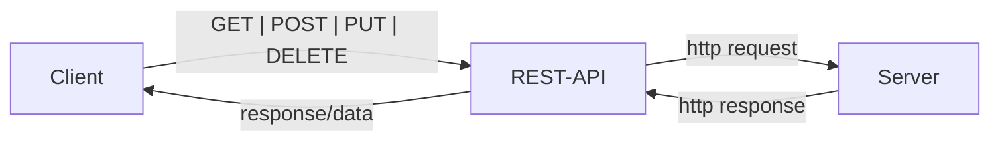
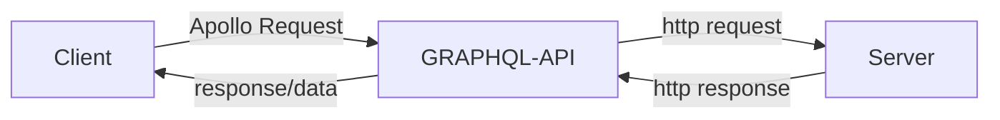

# GraphQL Crash Course with Full Stack MERN Project notes
[tut repo](https://github.com/bradtraversy/project-mgmt-graphql/tree/main)

# 1. Difference between GraphQL and REST API
 ## How REST API works
- A REST API has endpoints for all resources
  - The client sends a request to an endpoint
    - then the REST API receives it
      - routes it to an endpoint which retrieves the data from the database server
        - The data is then returned to the client, all the data for the endpoint.

flow diagram       


- All responses include ALL data
- Many endpoints for all resources
- The data will likely be JSON data (or HTML depenending on the API)

## How GRAPQL API works
- The GraphQL API only has a single endpoint
- It receives queries from the client using the Apollo server.
  - it then parses this query and sends it to database server
  - the server send an http response
  - graph ql then sends the info back to the client
    - only the data that the client has asked for.

flow diagram       

- Responses ONLY include the data asked for
- GraphQL-API is a single endpoint

## Queries Syntax
- example of a request/query
``` JS GraphQL Request/Query
{
  client(id: "100") {
    name,
    client {
      name
    }
  }
}
```
- example of a response
``` JS Server
{
  "data": {
    "project": {
      "name": "Mobile Application",
      "client": {
        "name": "Tony Start"
      }
    }
  }
}
```
- they look quite similar and are the syntaxt thus pretty easy to work with knowing javascript

## Mutations Syntax
- To add/update data to the server
``` JS GraphQL Mutation
mutation {
  addProject(
    // What you're updating
    name: "Mobile Application",
    description: "This is a description",
    status: "Not Started",
    clientId: "1") {
      // What you want to get back
      name
      description
      status
    }
}
```
- example of response
``` JS Server
{
  "data": {
    "addProject": {
      "name": "Mobile Application",
      "description": "This is a description",
      "status": "Not Started"
    }
  }
}
```

## Schemas & Types
- GraphQL server have a "schema" that specifies all of the fields as well as their "types".
  - The most basic components of a GraphQL schema are `object types`

  - Scalar types include: String, Int, Float, Boolean, ID
``` JS GraphQL schema example
type Project {
  name: String!
  description: String!,
  status: String!
}
```

## Getting Started
- We're using `express-graphql` in this tutorial, this a GraphQL Server for Node.js with tools to use with Express
- There's also `Apollo Server` and `Graph CMS` to easily setup a GraphQL API

## The Stack we're using in this tutorial
- Front-End: Apollo Client, React, Bootstrap UI
- Server: Node.js, Express, GraphQL (express-graphql)
- Data: Atlas, MongoDB

# 2. Create Express Server
## Setup
**init - to create a package.json file** 
``` JS Terminal
npm init -y
```
## Install Dependencies
**build dependencies**
``` JS Terminal
npm i express express-graphql graphql mongoose cors colors
```
**dev dependencies**
``` JS Terminal
npm i -D nodemon dotenv
```

## basic express server setup
- Created `server/index.js`
- Added basic code to run the server
``` JS index.js
const express = require('express');
require('dotenv').config();

const PORT = process.env.PORT || 5000;

const app = express();

app.listen(PORT, console.log(`Server running on port ${PORT}`));
```
- Added script to run the server to `package.json`
``` JS package.json
"start": "node server/index.js",
"dev": "nodemon server/index.js"
```

# 3. Start GraphQL
- imported `const graphqlHTTP = require('express-graphql')`
- Added it as middleware
``` JS index.js
~~~ Server declaration ~~~~
// Middleware
app.use('/graphql', graphqlHTTP({
  schema,
  graphiql: process.env.NODE_ENV === 'development'
}));
```
- created `schema/schema.js` and import at the top of `index.js`

# 4. Start Schema
- addded a `sampleData.js` file with some mock data for testing

## Schema
- We destructure the `projects` and `clients` object from sampleData
- We import a couple of methods from graphql
- We declare a `ClientType` as a new  `GraphQLObjectType` with various parameters
  - effectively this ensures the keys have the right type
- We then declare a `RootQuery` as a new `GraphQLObjectType`
  - as keys:
    - we specify the `name`
    - we specify fields:
      - in fields we specify the type as `ClientType`
      - we specify an id as argument in `args`
      - we specify a resolve method
        - this will later contain the mongoose query but for now it just returns the result of a find call on `clients`

- We then export a new `GraphQLSchema` with an object that has `query: RootQuery` as field

``` JS schema/schema.js
const { projects, clients } = require('../sampleData.js');

const { 
  GraphQLObjectType, 
  GraphQLID, 
  GraphQLString, 
  GraphQLSchema 
} = require('graphql');

// Client Type
const ClientType = new GraphQLObjectType({
  name: 'Client',
  fields: () => ({
    id: { type: GraphQLID },
    name: { type: GraphQLString },
    email: { type: GraphQLString },
    phone: { type: GraphQLString }
  })
});

const RootQuery = new GraphQLObjectType({
  name: 'RootQueryType',
  fields: {
    client: {
      type: ClientType,
      args: { id: { type: GraphQLID } },
      resolve(parent, args){
        return clients.find(client => client.id === args.id);
      }
    }
  }
});

module.exports = new GraphQLSchema({
  query: RootQuery
});
```

# 5. Accessing the Graphiql Interface
[localhost:5000/graphql](http://localhost:5000/graphql) - gives us access to the interface where we can make queries
``` JS Graphiql query example
{
  client(id:"1"){
    name,
    email,
    phone,
  }
}
```

# 6. Query to get all clients
- added a cients field to the `RootQuery` object
  - this passes ClientType as a parameter when creating a `GraphQLList` instance
  - this allows for returning all the clients with data filtering in the query
``` JS schema.js
clients: {
    type: new GraphQLList(ClientType),
    resolve(parent, args) {
      return clients;
    }
  },
```

# 7. Project Type and Queries
- Added a Project type
``` JS schema.js
// Project Type
const ProjectType = new GraphQLObjectType({
  name: 'Project',
  fields: () => ({
    id: { type: GraphQLID },
    name: { type: GraphQLString },
    description: { type: GraphQLString },
    status: { type: GraphQLString },
  })
});
```

- Updated `RootQuery` with a Projects and Project field
``` JS schema.js
projects: {
  type: new GraphQLList(ProjectType),
  resolve(parent, args) {
    return projects;
  }
},
project: {
  type: ProjectType,
  args: { id: { type: GraphQLID } },
  resolve(parent, args){
    return projects.find(project => project.id === args.id);
  }
},
```

# 8. Getting the data of the client into the project query
- expanded `ProjectType` with
``` JS schema.js
client: {
  type: ClientType,
  resolve(parent, args){
    return clients.find(client => client.id === parent.clientId);
  }
}
```

# 9. Creating a MongoDB Database
- configured database on the webste and and hooked it up to compass

## Connecting the server to the database
- added `config/db.js`
``` JS 
const mongoose = require('mongoose');

const connectDB = async () => {
  const conn = await mongoose.connect(process.env.MONGO_URI);

  console.log(`MongoDB connected: ${conn.connection.host}`.cyan.underline.bold);
};

module.exports = connectDB;
``` 
- imported colors and connectDB into index.js
- called `connectDB` under server declaration
``` JS
// Connect to database
connectDB();
```

# 10. Creating Mongoose Models
## Client Model
- Added `models/Client.js` with a simple mongoose schema
``` JS models/Client.js
const mongoose = require('mongoose');

const ClientSchema = new mongoose.Schema({
  name: {
    type: String,
  },
  email: {
    type: String,
  },
  phone: {
    type: String,
  }
});

module.exports = mongoose.model('Client', ClientSchema);
```
## Project Model
- similar thing as for the client model but
  - the lowest field is a clientID that is gotten from a relationship with the `Client` model
    - this needs the type `mongoose.Schema.Types.ObjectId` and a ref `Client`

``` JS schema/Projects.js
const mongoose = require('mongoose');

const ProjectSchema = new mongoose.Schema({
  name: {
    type: String,
  },
  description: {
    type: String,
  },
  status: {
    type: String,
    enum: ['Not Started', 'In Progress', 'Completed'],
  },
  clientId: {
    type: mongoose.Schema.Types.ObjectId,
    ref: 'Client',
  }
});

module.exports = mongoose.model('Project', ProjectSchema );
```

# 11. Using the models in queries
- Imported the models into `schema.js` 
- modified `RootQuery` to use the models
``` JS schema.js
const RootQuery = new GraphQLObjectType({
  name: 'RootQueryType',
  fields: {
    projects: {
      type: new GraphQLList(ProjectType),
      resolve(parent, args) {
        return Project.find();
      }
    },
    project: {
      type: ProjectType,
      args: { id: { type: GraphQLID } },
      resolve(parent, args){
        return Project.findById(args.id);
      }
    },
    clients: {
      type: new GraphQLList(ClientType),
      resolve(parent, args) {
        return Client.find();
      }
    },
    client: {
      type: ClientType,
      args: { id: { type: GraphQLID } },
      resolve(parent, args){
        return Client.findById(args.id);
      }
    }
  }
});
```
# 12. Mutate Data from MongoDB
[GraphQL Traversy Gists](https://gist.github.com/bradtraversy/fc527bc9a4659ab8de8e8066f3498723)

- Added a mutations object in `Schema.js`

## addClient mutation
  - in args we use `GraphQLNonNull` to ensure the user needs to pass in a value for this field
  - we also specify it has to be a string 
``` JS schema.js
~~~ Root Query ~~~~
// Mutations
const mutation = new GraphQLObjectType({
  name: 'Mutation',
  fields: {
    addClient: {
      type: ClientType,
      args: {
        name: { type: GraphQLNonNull(GraphQLString) },
        email: { type: GraphQLNonNull(GraphQLString) },
        phone: { type: GraphQLNonNull(GraphQLString) },
      },
      resolve(parent, args) {
        const client = new Client({
          name: args.name,
          email: args.email,
          phone: args.phone
        });

        return client.save();
      }
    },
  }
});
```

- Example of a mutation query for adding a client
``` JS
mutation {
  addClient(name: "Tony Stark", email: "ironman@gmail.com", phone: "955-365-3376") {
    id
    name
    email
    phone
  }
}
```

## deleteClient mutation
``` JS schema.js
// Delete a client
deleteClient: {
  type: ClientType,
  args: {
    id: { type: GraphQLNonNull(GraphQLID) },
  },
  resolve(parent, args) {
    return Client.findByIdAndDelete(args.id);
  }
}
```

# 13. Project Mutations
- Added `addProject` mutation
  - status is a `GraphQLEnumType` with a name, value options and a default value
  - clientId is a `GraphQLID`
  - The rest is similar to what was written for the client mutations
``` JS schema.js
~~~ Client mutations ~~~
// Add a project
addProject: {
  type: ProjectType,
  args: {
    name: { type: GraphQLNonNull(GraphQLString) },
    description: { type: GraphQLNonNull(GraphQLString)},
    status: { type: new GraphQLEnumType({
      name: 'ProjectStatus',
      values: {
        new: { value: 'Not Started'},
        progress: { value: 'In Progress'},
        completed: { value: 'Completed'}
      }
    }),
    defaultValue: 'Not Started',
    },
    clientId: { type: GraphQLNonNull(GraphQLID)}, 
  },
  resolve(parent, args) {
    const project = new Project({
      name: args.name,
      description: args.description,
      status: args.status,
      clientId: args.clientId,
    });

    return project.save();
  }
}
```
- Query to find the client data of a project
``` JS
{
  projects {
    name
    status
    client {
      name
      email
    }
  }
}
```

## Delete a project
- Added `deleteProject` mutation 
``` JS schema.js
~~~ Add Project ~~~
// Delete a project
deleteProject: {
  type: ProjectType,
  args: {
    id: { type: GraphQLNonNull(GraphQLID) }
  },
  resolve(parent, args) {
    return Project.findByIdAndDelete(args.id);
  }
}
```

## Update a project
- couple of important things
  - name and description don't require a value
  - the name of the enum needs to be unique
  - we use $set in the resolve
``` JS schema.js
~~~ Delete a project ~~~
// Update a project
updateProject: {
  type: ProjectType,
  args: {
    id: { type: GraphQLNonNull(GraphQLID)},
    name: { type: GraphQLString},
    description: { type: GraphQLString},
    status: {
      type: new GraphQLEnumType({
        name: 'ProjectStatusUpdate',
        values: {
          new: { value: 'Not Started' },
          progress: { value: `In Progress` },
          completed: { value: 'Completed' },
        }}),
    }, 
  },
  resolve(parent, args) {
    return Project.findByIdAndUpdate(
      args.id, 
      {
        $set: {
          name: args.name,
          description: args.description,
          status: args.status
        },
      },
      { new: true }
    );
  }
}
```


# 14. Frontend
## Server setup
- This is different from the tutorial but I find it more up to date.
``` JS Terminal
npm create vite@latest client
```
- settings: 
  - JavaScript + SWC

## client dependencies
- Install Apollo        | `npm i @apollo/client`
- Install GraphQL       | `npm i graphql`
- Install React-Router  | `npm i react-router-dom`
- Install React-Icons   | `npm i react-icons` 

## Clean up frontend
- cleaned up src folder
- added graphql logo to assets folder
- added components folder
- copied over css from the tutorial repo
- cleaned up App.jsx

## Bootstrap import from CDN
- added cdn imports to index.html
  - these come from bootstrap.com (both the css and js import)

# 15. Header Component
- added `Header.jsx` in components folder
  - used `rfce` to generate boilerplate
  - imported logo
- Added nav element for the logo
``` JS Header.jsx
<nav className='navbar bg-light mb-4 p-0'>
  <div className="container">
    <div className="navbar-brand" href="/">
      <div className="d-flex">
        
        <div>Project Mgmt</div>
      </div>
    </div>
  </div>
</nav>
```
- imported the header into App.jsx

# 16. Setting up Apollo
- imported apollo and set up a client
``` JS App.jsx
import { ApolloProvider, ApolloClient, InMemoryCache } from '@apollo/client';

const client = new ApolloClient({
  uri: 'http://localhost:5000/graphql',
  cache: new InMemoryCache
});
```
- Wrapped the app contents into 
  - `<ApolloProvider client={client}> App Contents</AppolloProvider>`

# 17. Fetch & Display Clients
- added `components/Clients.jsx` and imported into `App.jsx`
- imported functions from apollo
  - `import { gql, useQuery } from '@apollo/client';`
- created a `GET_ClIENTS` constant
  - this has the query. It's the same we use in grapiql.
``` JS Clients.jsx
const GET_CLIENTS = gql`
  query getClients {
    clients {
      id
      name
      email
      phone
    }
  }
`;
```
- in the component
  - destructured the results of getQuery that uses GET_CLIENTS as paramaters
    - `const { loading, errors, data } = useQuery(GET_CLIENTS);`
    - useQuery handles it's own states, so we don't need to use context or redux
  - specified conditionals for displaying loading and an error message
    ``` JS
    if (loading) return <p>Loading...</p>;
    if (error) return <p>Something Went Wrong</p>;
    ```
  - used nullcoellencence operator to display the correct message in return method
  ``` JS
   <>
      {!loading && !error && (
        <h1>Clients</h1>
      )}
    </>
  ```

  ## Client CORS Access on Server
  - added `app.use(cors());` as middleware in `index.js` on the server

## Client Table
- Added client table
```JS Clients.jsx
<table className='table table-hover mt-3'>
  <thead>
    <tr>
      <th>Name</th>
      <th>Email</th>
      <th>Phone</th>
      <th></th>
    </tr>
  </thead>
  <tbody>
    {data.clients.map(client => (
      <ClientRow key={client.id} client={client} />
    ))}
  </tbody>
</table>
```
## ClientRow component
- Added ClientRow component
  - this returns a td to markup the data
``` JS ClientRow.jsx
import { FaTrash } from 'react-icons/fa';

export default function ClientRow( { client }) {
  return (
    <tr>
      <td>{ client.name }</td>
      <td>{ client.email }</td>
      <td>{ client.phone }</td>
      <td>
        <button className="btn btn-danger btn-sm">
          <FaTrash />
        </button>
      </td>
    </tr>
  )
}
```

# 18. Query organization
- added `queries/clientQueries.js` to the src folder
- moved query code in here
``` JS clientQueries.js
import { gql } from '@apollo/client';

const GET_CLIENTS = gql`
  query getClients {
    clients {
      id
      name
      email
      phone
    }
  }
`;

export { GET_CLIENTS };
```
- imported `GET_CLIENTS` into `Clients.jsx`
  - and removed query and gql import from this component

# 19. Spinner Component
- Added `Spinner.jsx` to components with following html
``` JS Spinner.jsx
<div className="d-flex justify-content-center">
  <div className="spinner-border" role="status">
    <span className="sr-only"></span>
  </div>
</div>
```
- imported into `Clients.jsx` and returned at following conditional : `if (loading) return <Spinner />;`

# 20. Delete Client Mutation
- added `mutations/clientMutations.js`
- added graphql query to delete a client
``` JS clientMutations.js
import { gql } from '@apollo/client';

const DELETE_CLIENT = gql`
  mutation deleteClient($id: ID!) {
    deleteClient(id: $id) {
      id
      name
      email
      phone
    }
  }
`;

export { DELETE_CLIENT };
```

## Using delete client mutation in ClientRow component
- imported `useMutation` from apollo/client
- imported DELETE_CLIENT mutation from `clientMutations.js`
- in the component:
  - added a constant called deleteClient
    - this is destructured from to the result of useMutation
      - useMutation takes in DElETE_CLIENT (the query), and an object with the id.
``` JS ClientRow
const [deleteClient] = useMutation(DELETE_CLIENT, {
    variables: { id: client.id }
  });` 
``` 
- on the button we then call `onClick={deleteClient}`

## Updating the client dom afterr running a mutation
- there's 2 methods for this

1. refetching the queries when `deleteClient` is called
  - this is fine if you don't do it too much
    - else it might start to bog down the application
``` JS ClientRow.jsx
const [deleteClient] = useMutation(DELETE_CLIENT, {
  variables: { id: client.id },
  refetchQueries: [{ query: GET_CLIENTS }]
});
```

2. updating the cache
``` JS ClientRow
const [deleteClient] = useMutation(DELETE_CLIENT, {
  variables: { id: client.id },
  update(cache, { data: { deleteClient }}){
    const { clients } = cache.readQuery({ query: GET_CLIENTS});

    cache.writeQuery({
      query: GET_CLIENTS,
      data: { clients: clients.filter(client => client.id !== deleteClient.id)}
    })
  }
}
```

## Preventing the `cache data may be lost` apollo error
- added a cache to `App.jsx` with typePolicies specified
  - this calls merge to merge the data
``` JS App.jsx
const cache = new InMemoryCache({
  typePolicies: {
    Query: {
      fields: {
        clients: {
          merge(existing, incoming) {
            return incoming
          }
        },
        projects: {
          merge(existing, incoming) {
            return incoming
          }
        }
      }
    }
  }
});
```
- we use this in the ApolloClient
``` JS App.jsx
const client = new ApolloClient({
  uri: 'http://localhost:5000/graphql',
  cache
});
```

# 21. Add Client Mutation
- added `ClientModal` component
  - nothing to fancy here, just a basic bootstrap modal
``` JS ClientModal.jsx
import { useState } from 'react';
import { FaUser } from 'react-icons/fa';
import { useMutation } from '@apollo/client';

export default function AddClientModal() {
  return (
    <>
      <button type="button" 
        className="btn btn-secondary" 
        data-bs-toggle="modal" 
        data-bs-target="#addClientModal">
        <div className="d-flex align-items-center">
          <FaUser className='icon'/>
          <div>Add Client</div>
        </div>
      </button>
  
      <div className="modal fade" id="addClientModal" aria-labelledby="addClientModalLabel" aria-hidden="true">
        <div className="modal-dialog">
          <div className="modal-content">
            <div className="modal-header">
              <h1 className="modal-title fs-5" id="addClientModalLabel">New Client</h1>
              <button type="button" className="btn-close" data-bs-dismiss="modal" aria-label="Close"></button>
            </div>
            <div className="modal-body">
              <form>
                <div className="mb-3">
                  <label className="form-label">Name</label>
                  <input type="text" className="form-control" id="name" />
                </div>
              </form>
            </div>
          </div>
        </div>
      </div>
    </>
  )
}
```

## ClientForm states
- Added states in component
``` JS AddClientModal.jsx
const [name, setName] = useState('');
const [email, setEmail] = useState('');
const [phone, setPhone] = useState('');
```
- used in form 
```JS AddClientModal.jsx
<form>
  <div className="mb-3">
    <label className="form-label">Name</label>
    <input 
      type="text" className="form-control" 
      id="name" value={name} 
      onChange={ (e) => setName(e.target.value) } />
  </div>
  <div className="mb-3">
    <label className="form-label">E-mail</label>
    <input 
      type="email" className="form-control" 
      id="email" value={email} 
      onChange={ (e) => setEmail(e.target.value) } />
  </div>
  <div className="mb-3">
    <label className="form-label">Phone</label>
    <input 
      type="text" className="form-control" 
      id="phone" value={phone} 
      onChange={ (e) => setPhone(e.target.value) } />
  </div>
</form>
```

## AddClientModal submit button
- added `onSubmit` method to AddClientModal component
``` JS AddClientModal.jsx
const onSubmit = (e) => {
  e.preventDefault();
  console.log(name, email, phone);
};
```
- Added button to the form
  - `data-bs-dismiss="modal"` is an attribute we can use to close the modal when the button is pressed
``` JS AddClientModal.jsx
<button 
  type="submit" 
  data-bs-dismiss="modal" 
  className="btn btn-secondary">
    Submit
</button>
```
- updated form to call the onSubmit method
``` JS AddClientModal.jsx
<form onSubmit={onSubmit}>
```
## Adding addClient Mutation
- added ADD_CLIENTS query to `clientMutations.js`
``` JS mutations/clientMutations.js
const ADD_CLIENT = gql`
  mutation addClient($name: String!, $email: String!, $phone: String!) {
    addClient(name: $name, email: $email, phone: $phone) {
      id
      name
      email
      phone
    }
  }
`;
```
- imported ADD_CLIENTS and GET_CLIENTS into `AddClientModal.jsx`
- added a mutation to the component
  - similar to delete
  - we use the spread operator to get the existing clients and then add the new client result to it
``` JS AddClientModal.jsx
const [ addClient ] = useMutation(ADD_CLIENT, {
  variables: { name, email, phone },
  update(cache, { data: { addClient }}){
    const { clients } = cache.readQuery({ query: GET_CLIENTS});

    cache.writeQuery({
      query: GET_CLIENTS,
      data: { clients: [...clients, addClient] }
    })
    }
})
```
- in `onSubmit` we call addClient after some validation
``` JS AddClientModal.jsx
if(name === '' || email === '' || phone === ''){
  return alert('Please fill in all fields');
} 

addClient(name, email, phone);

setName('');
setEmail('');
setPhone('');
```

# 22. Displaying Project in the client
## Adding the project queries
- continuation of the steps to specify client queries
  - added `queries/projectQueries.js`
``` JS projectQueries.js
import { gql } from '@apollo/client';

const GET_PROJECTS = gql`
  query getProjects{
    projects {
      id
      name
      status
    }
  }
`;

export { GET_PROJECTS };
```

## ProjectCard component
- Added `components/ProjectCard.jsx`
  - nothing special here yet
``` JS ProjectCard.jsx


export default function ProjectCard( { project } ) {
  return (
    <div className="col-md-6">
      <div className="card mb-3">
        <div className="card-body">
          <div className="d-flex justify-content-between align-items-center">
            <h5 className="card-title">{project.name}</h5>
            <a className="btn btn-light" href={`/projects/${project.id}`}>
              View
            </a>
          </div>
          <p className="small">
            Status: <strong>{project.status}</strong>
          </p>
        </div>
      </div>
    </div>
  )
}

```

## Displaying Projects
- Added `components/Projects.jsx`
- imported Spinner, useQuery, GET_PROJECTS and ProjectCard

- added component code to map through the projects if the result is greater than 0
  - we use `ProjectCard` to display the data
``` JS Projects.jsx
export default function Projects() {
  const { loading, error, data } = useQuery(GET_PROJECTS);

  if (loading) return <Spinner/>;
  if (error) return <p>Something Went Wrong</p>;

  return (
    <>
      { data.projects.length > 0 ? (
        <div className="row">
          { data.projects.map(project => (
            <ProjectCard key={project.id} project={project} />
          ))}
        </div>) 
        : (<p>No Projects</p>)}
    </>
  )
}
``` 

# 23. React Router Setup
- imported react-router-dom components in App.jsx | `import { BrowserRouter as Router, Route, Routes } from 'react-router-dom';` 
- modified return function of App.jsx
  - Wrapped all the contents into a `Router` element
``` JS App.jsx
<ApolloProvider client={client}>
  <Router>
    <Header />
    <div className="container">
      <AddClientModal />
      <Projects />
      <Clients />
    </div>
  </Router>
</ApolloProvider>
```

# 24. Pages Setup
- Added `pages` folder to src folder
- Added files for `Home.jsx`, `NotFound.jsx` and `Project.jsx`

## Home Page
- Populated return with components to display
``` JS Home.jsx
<>
  <div className="d-flex gap-3 mb-4">
    <AddClientModal />
  </div>
  <Projects />
  <hr />
  <Clients />
</>
```

## Not Found page
- Populated component return
``` JS NotFound.jsx
<div className="d-flex flex-column justify-content-center align-items-center mt-5">
  <FaExclamationTriangle className="text-danger" size="5em" />
  <h1>404</h1>
  <p className="lead">Sorry, this page does not exist</p>
  <Link to="/" className="btn btn-primary">
    Go Back 
  </Link>
</div>
```
- in App.jsx imported the component 
  - in the Routes element put it below the other pages with a 'path='*' to cover all other page routes
  ``` JS App.jsx
  <Route path='*' element={<NotFound />} />
  ```

## Project page
- populated `Project` page with component boilerplate
``` JS Project.jsx
export default function Project() {
  return (
    <div>Project</div>
  )
}
```
- imported into App.jsx and added inside Routes component
  - `<Route path='/projects/:id' element={<Project />} />` | We're using /:id so we can get a unique project by id

## Single Project query
- added `GET_PROJECT` query
  - very simple repetition of the other queries
``` JS projectQueries.js
const GET_PROJECT = gql`
  query getProject($id: ID!) {
    project(id: $id) {
      id
      name
      description
      status
      client {
        id
        name
        email
        phone
      }
    }
  }
`;
```

## Project Layout
- desctructured the id from params
- destructured `GET_PROJECT` results 
- Added conditionals for spinner and error
``` JS Project.jsx
const { id } = useParams();
const { loading, error, data } = useQuery(GET_PROJECT, {variables: { id }});

if (loading) return <Spinner />;
if (error) return <p>Something Went Wrong</p>;
```

- rendered the project data
``` JS Project.jsx
<>
  {!loading && !error && (
    <div className="mx-auto w-75 card p-5">
      <Link to="/" className="btn btn-light btn-sm w-25 d-inline ms-auto">
        Back
      </Link>

      <h1>{data.project.name}</h1>
      <p>{data.project.description}</p>
      
      <h5 className="mt-3">Project Status</h5>
      <p className="lead">{ data.project.status} </p>

      <ClientInfo client={data.project.client} />
    </div>
  )}
</>
```

## ClientInfo layout
- Added `ClientInfo.jsx` to component folder
- populated return with client info
``` JS ClientInfo.jsx
<>
  <h5 className="mt-5">Client Information</h5>
  <ul className="list-group">
    <li className="list-group-item">
      <FaIdBadge className="icon" />{client.name}
    </li>
    <li className="list-group-item">
      <FaEnvelope className="icon" />{client.email}
    </li>
    <li className="list-group-item">
      <FaPhone className="icon" /> {client.phone}
    </li>
  </ul>
</>
```

# 25. Add Project Modal
- Added `AddProjectModal` component
- imports:
``` JS AddProjectModal.jsx
import { useState } from 'react';
import { FaList } from 'react-icons/fa';
import { useMutation, useQuery } from '@apollo/client';
import { GET_PROJECTS } from '../queries/projectQueries';
```
- states:
``` JS AddProjectModal.jsx
const [name, setName] = useState('');
const [description, setDescription] = useState('');
const [status, setStatus] = useState('new');
const [clientId, setClientId] = useState('');
```
- onSubmit function
  - temporary untill we implement the GET_CLIENT query
``` JS AddProjectModal.jsx
const onSubmit = (e) => {
  e.preventDefault();
  
  if(name === '' || description === '' || status === ''){
    return alert('Please fill in all fields');
  } 

  setName('');
  setDescription('');
  setStatus('');
};
```

- component return function
  - very similar to `AdddClientModal` but the form fiels are a bit different
    - for the status we use a `select` element
    - for the description we use a `textarea` element
``` JS AddProjectModal.jsx
return (
  <>
    <button type="button" 
      className="btn btn-primary" 
      data-bs-toggle="modal" 
      data-bs-target="#addProjectModal">
      <div className="d-flex align-items-center">
        <FaList className='icon'/>
        <div>New Project</div>
      </div>
    </button>

    <div className="modal fade" id="addProjectModal" aria-labelledby="clientModalLabel" aria-hidden="true">
      <div className="modal-dialog">
        <div className="modal-content">
          <div className="modal-header">
            <h1 className="modal-title fs-5" id="clientModalLabel">New Project</h1>
            <button type="button" className="btn-close" data-bs-dismiss="modal" aria-label="Close"></button>
          </div>
          <div className="modal-body">
            <form onSubmit={onSubmit}>
              <div className="mb-3">
                <label className="form-label">Name</label>
                <input 
                  type="text" className="form-control" 
                  id="name" value={name} 
                  onChange={ (e) => setName(e.target.value) } />
              </div>
              <div className="mb-3">
                <label className="form-label">Description</label>
                <textarea 
                  className="form-control" 
                  id="description" value={description} 
                  onChange={ (e) => setDescription(e.target.value) } />
              </div>
              <div className="mb-3">
                <label className="form-label">Status</label>
                <select 
                  className="form-select" 
                  id="status" value={status} 
                  onChange={ (e) => setStatus(e.target.value) }>
                    <option value="new">Not Started</option>
                    <option value="progress">In Progress</option>
                    <option value="completed">Completed</option>
                  </select>
              </div>
              <button 
                type="submit" 
                data-bs-dismiss="modal" 
                className="btn btn-primary">
                  Submit
              </button>
            </form>
          </div>
        </div>
      </div>
    </div>
  </>
)
```

## Get clients for the modal
- desctructured the results of GET_CLIENTS 
``` JS AddProjectModal.jsx 
// Get Clients for select
const { loading, error, data } = useQuery(GET_CLIENTS);`
```

- added conditionals for rendering when loading or when there's an error
``` JS AddProjectModal.jsx
if (loading) return null
if (error) return 'Something Went Wrong';
```

- Wrapped all of the return contents into a conditional
``` JS AddProjectModal.jsx
{ !loading && !error && (
  <>
  ~~~ Project Modal Layout goes here ~~~
  </>
) }
```
- Under the status field added an element to display a selectbox for the clients
  - this maps over the clients returned from the query
  ``` JS AddProjectModal.jsx
  <div className="mb-3">
    <label className="form-label">Client</label>
    <select id="clientId" className="form-select" 
    value={clientId} onChange={(e) => setClientId(e.target.value)}>
      <option value="">Select Client</option>
      {data.clients.map(client => (
        <option key={client.id} value={client.id}>{client.name}</option>
      ))}
    </select>
  </div>
  ```

## AddProject Mutation
- Added `ADD_PROJECT` mutation to `mutations/projectMutations.jsx`
  - largely repetition of the addClient query
  - but status's type if of ProjectStatus, this type was defined on the backend
  
``` JS projectMutations.jsx
import { gql } from '@apollo/client';

const ADD_PROJECT = gql`
  mutation addProject($name: String!, $description: String!, $status: ProjectStatus!, $clientId: ID! ) {
    addProject(name: $name, description: $description, status: $status, clientId: $clientId) {
      id
      name
      description
      status
      client {
        id
        name
        email
        phone
      }
    }
  }
`;

export { ADD_PROJECT };
```


